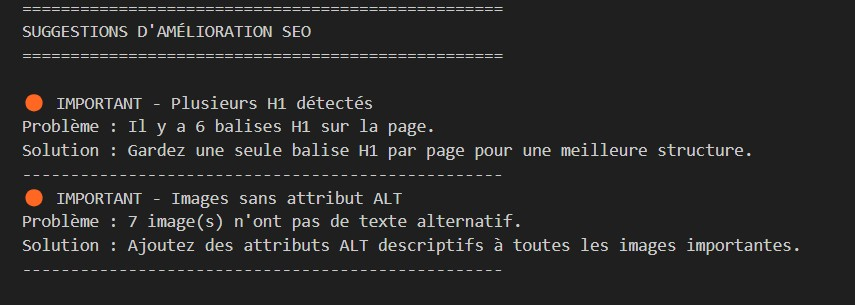

# SEO Titan 🔍

<div>
  
</div>


Un outil d'analyse SEO avancé qui examine une page web et génère un rapport détaillé sur différents aspects SEO importants. Cet outil est conçu pour aider les webmasters et les spécialistes SEO à identifier rapidement les problèmes et opportunités d'optimisation.

## ✨ Fonctionnalités

### 📊 Analyse Technique
- Vérification SSL/HTTPS
- Analyse des temps de chargement
- Vérification de l'optimisation mobile
- Analyse des en-têtes HTTP
- Vérification du robots.txt
- Analyse du sitemap.xml

### 📝 Analyse du Contenu
- Titre de la page et meta tags
- Structure des titres (H1, H2, H3)
- Longueur et qualité du contenu
- Densité des mots-clés
- Images et attributs ALT
- Liens internes et externes

### 🔎 Analyse SEO Avancée
- Balises Schema.org
- Open Graph tags
- Balises canoniques
- Meta robots
- Favicon

### 💡 Suggestions d'Amélioration
- Recommandations priorisées (Critique, Important, Modéré, Mineur)
- Solutions concrètes pour chaque problème
- Bonnes pratiques SEO
- Conseils d'optimisation

<div>
  
</div>

## 🚀 Installation

1. Clonez ce dépôt :
```bash
git clone https://github.com/votre-username/seo-analyzer.git
cd seo-analyzer
```

2. Créez un environnement virtuel (recommandé) :
```bash
python -m venv venv
source venv/bin/activate  # Linux/Mac
venv\Scripts\activate     # Windows
```

3. Installez les dépendances :
```bash
pip install -r requirements.txt
```

## 💻 Utilisation

1. Lancez l'analyseur :
```bash
python seo_analyzer.py
```

2. Suivez les instructions dans le terminal :
   - Entrez l'URL du site à analyser
   - Spécifiez le nom du fichier de sortie pour le rapport

3. Le rapport sera généré au format texte avec les sections suivantes :
   - Informations techniques
   - Analyse du contenu
   - Problèmes SEO détectés
   - Suggestions d'amélioration

## 📋 Format du Rapport

Le rapport est généré au format texte et contient plusieurs sections :

```
RAPPORT D'ANALYSE SEO
====================
URL analysée: https://example.com
Date: 2025-01-01 09:13:04

...

SUGGESTIONS D'AMÉLIORATION
====================
CRITIQUE - Meta description manquante
Problème : Aucune meta description n'est définie.
Solution : Ajoutez une meta description de 150-160 caractères.
...
```

## 🛠️ Dépendances

- Python 3.8+
- requests==2.31.0
- beautifulsoup4==4.12.2
- colorama==0.4.6
- tqdm==4.66.1
- lxml==5.1.0
- python-dateutil==2.8.2
- validators==0.22.0
- urllib3==2.0.7

## 🤝 Contribution

Les contributions sont les bienvenues ! Voici comment vous pouvez aider :

1. Fork le projet
2. Créez votre branche de fonctionnalité (`git checkout -b feature/AmazingFeature`)
3. Committez vos changements (`git commit -m 'Add some AmazingFeature'`)
4. Push vers la branche (`git push origin feature/AmazingFeature`)
5. Ouvrez une Pull Request

## 📄 Licence

Ce projet est sous licence MIT. Voir le fichier [LICENSE](LICENSE) pour plus de détails.

## 👥 Auteurs

- Benjamin Jaccob - *Développeur initial*

## 🙏 Remerciements

- BeautifulSoup4 pour le parsing HTML
- Requests pour les requêtes HTTP
- Colorama pour les couleurs dans le terminal
